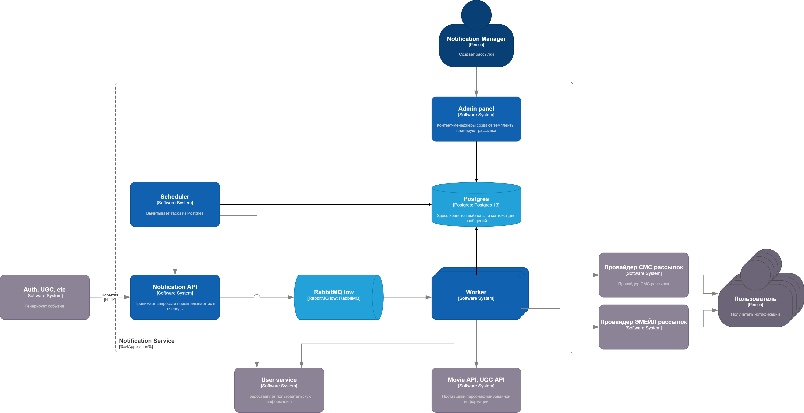

[](https://github.com/wemake-services/wemake-python-styleguide)
[](https://github.com/TheZavitaev/notifications_sprint_1/actions)
[](https://pycqa.github.io/isort/)


# Проектная работа 10 спринта
Сервис для отправки уведомлений.

## Система состоит из следующих элементов:

### Ядро системы - это админка.

[Подробнее в README](admin/readme.md)

Контент-менеджер создает шаблон, присваивает ему тип рассылки и способ отправки.
У шаблона есть параметр `code` - вид шаблона. По этому параметру воркер определяет нужно ли для этого шаблона собирать контекст и как это делать. Сейчас есть два вида шаблонов: common и monthly_personal_statistic. Для common контекст не собирается. В сообщение на этапе шаблонизации подставится только first_name и second_name пользователя. Для шаблонов вида monthly_personal_statistic собирается количество просмотренных фильмов за месяц и любимый жанр пользователя.

После этого контент-менеджер создает "задание". 

В задании необходимо указать используемый шаблон, приоритет, контекст, список пользователей, список категорий пользователей и планируемое время отправки.

Шаблоны и задания хранятся в Postgres. Далее с заданиями работает шедулер.

### Scheduler - спусковой крючек для отправки заданий

[Подробнее в README](scheduler/readme.md)

Шедулер поллит БД админки и достает задания которые нужно отправить, превращает категорию пользователей в список пользователей, разбивает задание на чанки с фиксированным количеством пользователей и отправляет дальше.

### API - единая точка входа.

[Подробнее в README](api/readme.md)

Если просто, то АПИшка принимает запросы по сети от внешних сервисов и шедулера, и перекладывает их RabbitMQ.

### Worker - несчастный разгребатель.

[Подробнее в README](worker/readme.md)

Воркер достает новые задания для отправки из RabbitMQ.
Для каждого задания он достает template из базы, для каждого пользователя в задании запрашивает его данные (фамилия, имя, почта), собирает контекст (если это необходимо), шаблонизирует письмо собранным контекстом и отправляет нужным транспортом. Также воркер проверяет хочет ли пользователть получать рекламные сообщения.

### User service

[Подробнее в README](user_service/readme.md)

Это тестовый сервис для выдачи пользовательских данных. Он возвращает ФИО пользователя, его адрес, настройки уведомлений, категории, статистика просмотра.


## Схема



# Как запустить локально

Создаем `.env` файл и наполняем его секретами аналогично `.env.template`. 

После этого можно приступать к сборке:

```shell
docker-compose up --build
docker-compose exec admin_panel python manage.py createsuperuser
docker-compose exec admin_panel python manage.py loaddata fixtures/admin_panel_data.json
```

Теперь можно пойти панель админа panel http://127.0.0.1:8000/admin/

## Запустить отпраку писем

Переключить [задачу](http://127.0.0.1:8000/admin/admin_panel/mailingtask/2/change/) в состояние `В очередь на отправку`
Смотреть логи контейнера worker

## Подергать через Notification API
Заходим в swagger - http://127.0.0.1:8001/docs#

Посылаем ивенты

Имитация работы воркера:
```json
{
  "event": {
    "is_promo": true,
    "priority": "low",
    "template_id": 3,
    "user_ids": [
      "894cd492-a3bc-424c-895f-1f2772074304",
      "6c88ad4d-a9f7-440f-ba22-45d00c41a072",
      "8509b63e-aceb-431f-9008-665ffff772d0",
      "581defac-e938-44f5-971a-00db5c4031df",
      "80fd41eb-9a85-4995-a127-9c12c7a2493f"
    ],
    "context": {}
  }
}
```
Имитация событий от AUTH
```json
{
    "user_id": "39275483-d542-400a-bb7c-6aefa15fbee6"
}
```

# Над проектом работали:

[Елисей Равнюшкин](https://github.com/elisey)  
[Олег Завитаев](https://github.com/TheZavitaev)  
