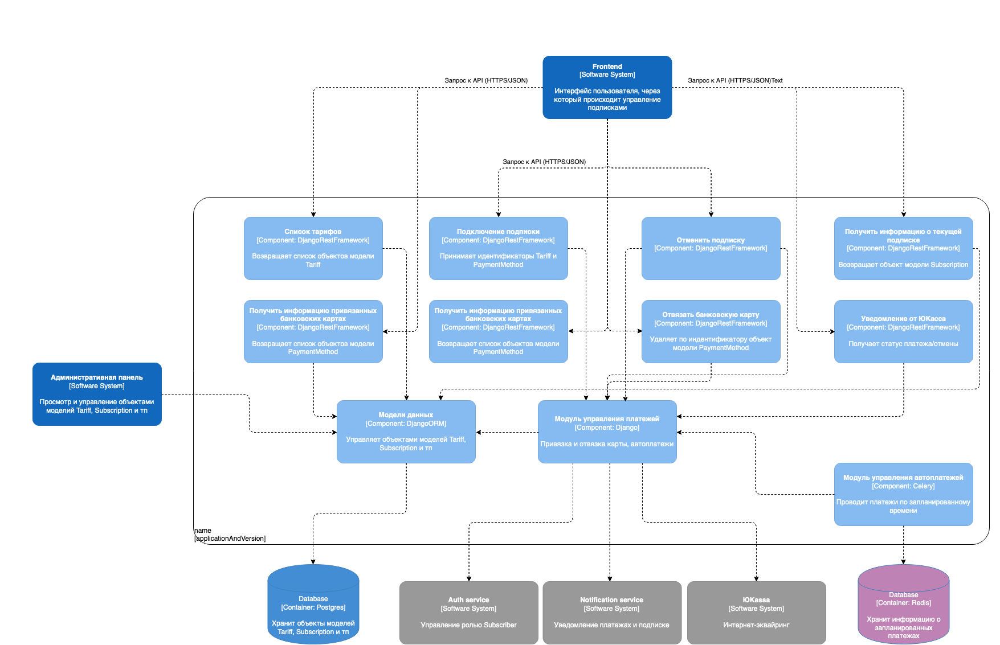
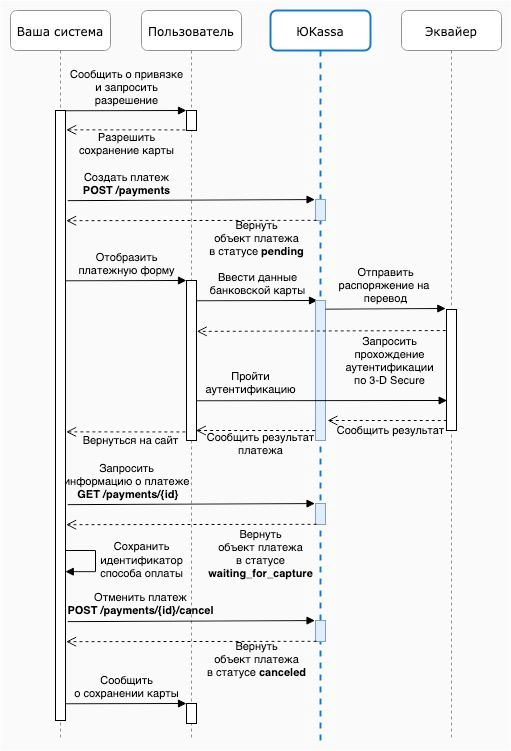

# 🌟 Биллинговый сервис

## 🛠 Стек технологий

[](https://skillicons.dev)


## 🎡 Схема компонентов




###Сервис имеет 10 методов

❗️В заголовках запроса используйте `access_token` для аутентификации (`Authorization: Bearer access_token`), который можно получить по ссылке `http://localhost/api/v1/user` ❗️

1. Получить список тарифов
```http request
GET - /billing/tariffs 
```

Возможный ответ

```json
{
    "count": 2,
    "next": null,
    "previous": null,
    "results": [
        {
            "id": "70caff03-069d-4cdc-8d65-656ebceb2bcf",
            "title": "Еженедельная подписка",
            "cost": "99.99",
            "period_type": "week",
            "description": "Еженедельная подписка",
            "is_active": true,
            "trial_period": false,
            "trial_period_type": null
        },
        {
            "id": "8fe840f2-0f8b-4a58-8d56-ce26327746c3",
            "title": "Ежемесячная подписка",
            "cost": "249.99",
            "period_type": "month",
            "description": "Ежемесячная подписка",
            "is_active": true,
            "trial_period": true,
            "trial_period_type": "week"
        }
    ]
}
```

2. Добавить способ оплаты
```http request
POST - /billing/payment-method
```

Вернет ссылку на ЮКассу, по которой необходимо перейти и заполнить данные карты
```json
{
    "confirmation_url": "https://yoomoney.ru/checkout/payments/v2/contract?orderId=2bcf4466-000f-5000-a000-1f63903828f9"
}
```

После успешного списания, карта привяжется к магазину и пользователю предложат вернуться на сайт, а именно на следующий эндпоинт

3. Подтверждение способа оплаты. 
```http request
GET - /billing/approve-payment-method/<idempotency_key>
```
Если платеж прошел, то бекенд сохраняет идентификатор способа оплаты и возвращает деньги пользователю.
В дальнейшем полученный способ оплаты можно использовать в автоплатежах. 

Болле подробный алгоритм действий 
привязки способа оплаты представлен на схеме ниже.



4. Оформить подписку

```http request
POST - /billing/subscription
```

Тело запроса
```json
{
    "tariff": "70caff03-069d-4cdc-8d65-656ebceb2bcf",
    "payment_method": "65fdda45-75f2-4430-9fac-771226b27adf"
}
```

Если тариф предусматривает пробный период, и у пользователя не было до этого подписки, создатся объект подписки `Subscription` и пользователю 
присвоится роль `Subscriber` без оплаты за пробный период.

Если способ оплаты не имеет 3DS, то после успешного списания, создатся объект подписки `Subscription` и пользователю 
присвоится роль `Subscriber`.

В противном случае бекенд вернет ссылку для подтверждения оплаты. После успешного подтверждения оплаты, ЮКасса предложит
пользователю вернуться на сайт по эндпоинту ниже.

5. Подтверждение оплаты
```http request
GET - /billing/approve-payment/<idempotency_key>
```

После успешного подтверждения платежа, создатся объект подписки `Subscription` и пользователю 
присвоится роль `Subscriber`.

6. Отменить подписку
```http request
PUT - /billing/cancel-subscription
```

Если у пользователя пробный период, то после отмены, у пользоваетля отзывается роль `Subscriber` и в статусе объекта 
`Subscription` выставляем `canceled`.

Если подписка пользователя длиться меньше 2-х дней, то после отмены оформляется возврат средств и в статусе объекта 
`Subscription` выставляем `canceled`.

Если подписка пользователя длиться больше 2-х дней, то после отмены не оформляется возврат средств, а в статусе объекта 
`Subscription` выставляем `no_auto_payemnt` (что подписка без автопродления).

7. Получить информацию о подписке
```http request
GET - /billing/subscription
```

```json
{
    "id": "c4d314e2-b319-4519-acdd-2729978a9e1c",
    "ended_at": "2023-04-23T23:55:51.141164Z",
    "status": "active",
    "created_at": "2023-04-17T02:55:51.146827+03:00",
    "modified_at": "2023-04-17T02:55:51.147097+03:00",
    "tariff": {
        "id": "70caff03-069d-4cdc-8d65-656ebceb2bcf",
        "title": "Еженедельная подписка",
        "cost": "99.99",
        "period_type": "week",
        "description": "Еженедельная подписка",
        "is_active": true,
        "trial_period": false,
        "trial_period_type": null
    },
    "payment_method": {
        "id": "65fdda45-75f2-4430-9fac-771226b27adf",
        "created_at": "2023-04-16T01:13:23.015096+03:00",
        "modified_at": "2023-04-16T01:13:23.015369+03:00",
        "card_type": "Mir",
        "expire": "12/2024",
        "last4": "2987",
        "first6": "220247"
    }
}
```

8. Получить список привязанных способов оплаты
```http request
GET - /billing/payment-method
```

Пример ответа
```json
{
    "count": 3,
    "next": null,
    "previous": null,
    "results": [
        {
            "id": "65fdda45-75f2-4430-9fac-771226b27adf",
            "created_at": "2023-04-16T01:13:23.015096+03:00",
            "modified_at": "2023-04-16T01:13:23.015369+03:00",
            "card_type": "Mir",
            "expire": "12/2024",
            "last4": "2987",
            "first6": "220247"
        },
        {
            "id": "f2b3a0b9-d837-4e24-b114-6d1937a0a970",
            "created_at": "2023-04-16T22:59:49.825714+03:00",
            "modified_at": "2023-04-16T22:59:49.825907+03:00",
            "card_type": "Mir",
            "expire": "12/2023",
            "last4": "0004",
            "first6": "220000"
        },
        {
            "id": "c7af5746-6aad-4350-b312-44bb3af24192",
            "created_at": "2023-04-17T14:45:44.742506+03:00",
            "modified_at": "2023-04-17T14:45:44.742636+03:00",
            "card_type": "Visa",
            "expire": "12/2025",
            "last4": "1111",
            "first6": "411111"
        }
    ]
}
```

9. Поменять способ оплаты у подписки
```http request
PUT - /billing/change-payment-method
```

Тело запроса
```json
{"payment_method_id": "65fdda45-75f2-4430-9fac-771226b27adf"}
```

10. Отвязать карту
```http request
DELETE - /billing/payment-method/<payment_method_id>
```

## 🏎 Автоплатежи
За автоплатежи ответствен `celery`, который раз в час запускает две таски:

1. `check-subscriptions` - находит все подписки, которые подошли к концу и проводит по ним списание средств. 
   Если оплата требует подтверждения (3DS), то у пользователя отзывается роль `Subscriber` до момента подтверждения.
   Если оплата не прошла, то у пользователя отзывается роль `Subscriber` до момента оплаты, а подписке назначается статус `waiting`, который активен в течение недели.
   
2. `check-subscriptions-without-auto-payment` - находит все подписки, которые подошли к концу и имеют статус `no_auto_payment`. У пользователя отзывается роль `Subscriber`.

## 🪄 Тестирование

0. Поднимите контейнеры `postgres`, `redis`, `auth` и `notification`.
1. Переименуйте `.env.sample` -> `.env`, указав актуальные параметры виртуального окружения.
2. Выполните команды `python manage.py runserver` и `celery -A app worker -B`, чтобы запустить сервис.


## 🔑 Виртуальное окружение

Для корректной работы лучше указать собственные ключи от ЮКассы, но на всякий случай мы приложили свои от тестового магазина.

Также предварительно необходимо создать роль `Subscriber` в сервисе авторизации (сделать это можно через OpenAPI по `http://localhost/api/v1/user/`) и установит его идентификатор в виртуальном окружении. 


## 🚀 Запуск
Перейдите в корень проекта.
Для запуска всего проекта выполните одну из команд:

- `make dev docker`
- `make prod docker`

Если запускаете первый раз, то не забудьте накатить миграции командой `init migrations`