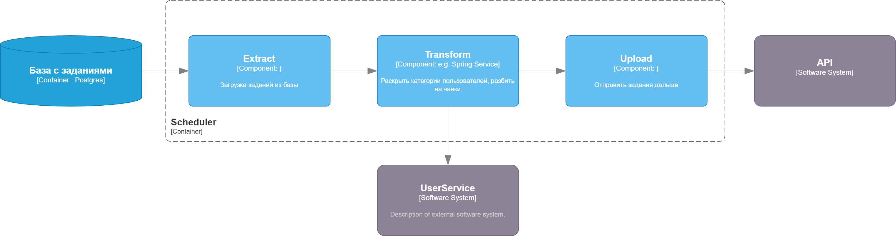

# Модуль отвечающий за отправку заданий из базы



Модуль достает из базы задания со статусом `pending` и временем отправки < `current_timestamp`
Далее каждая категория пользователей заменяется на список id пользователей и добавляется к user_ids
Потом модуль разбивает задание на несколько кусов, чтобы в каждом куске было ограниченное количество пользователей. 
Например, если будет задание на отправку сообщения категории пользователей в 5000, мы разобьем это задание на 10 
кусочков по 500 человек, чтобы эти задания выполнялись на воркере не целиком.

На выходе вот такие данные

```json
{
  "id": 2,
  "is_promo": true,
  "priority": "low",
  "template_id": 3,
  "user_ids": [
    "f6b04881-c4e8-432e-9a32-ef21fc642b90",
    "02ba8560-d3c4-41c0-b3ef-daba1598459e",
    "e81d11b5-2ed7-48c7-bf39-afa5e0e46e72",
    "bd047e64-704f-4087-9c8c-0c2d57fa53fd",
    "7279cc5a-2601-4059-bcbc-9e3e6aa63767"
  ],
  "context": {}
}
```

Затем модуль отправляет готовые задания в API
