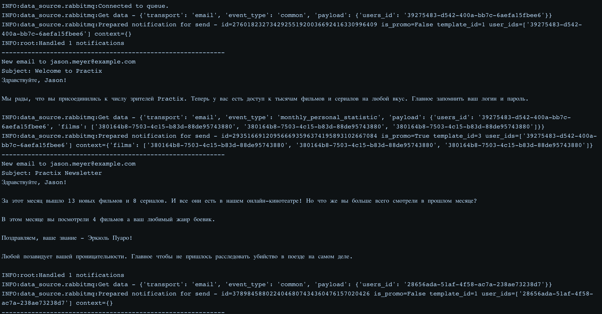

# Модуль, который шаблонизирует и рассылает уведомления

Этот модуль достает задание типа

```shell
{
  "is_promo": true,
  "priority": "low",
  "template_id": 3,
  "user_ids": [
    "f6b04881-c4e8-432e-9a32-ef21fc642b90",
    "02ba8560-d3c4-41c0-b3ef-daba1598459e",
    "e81d11b5-2ed7-48c7-bf39-afa5e0e46e72",
    "bd047e64-704f-4087-9c8c-0c2d57fa53fd",
    "7279cc5a-2601-4059-bcbc-9e3e6aa63767"
  ],
  "context": {
    "film_id": "7279ccaf-2601-4059-bcbc-9e3e6aa63767"
    "film_name": "День сурка"
  }
}
```

Затем он
 - Загружает шаблон из БД по его `template_id`
 - Для каждого пользователя из массива `user_ids`
   - Загружает данные пользователя: фамилия, имя, почта и добавляются в контекст
   - Если задание `is_promo==True` и пользователь отказался получать рекламу - дропаем
   - Проверяет тип шаблона, если для этого шаблона есть сборщик контекста, то он запускается и собранный контекст добавляется в общий
   - Выполняется шаблонизация со всем контекстом (то, что было задано в админке, данные пользователя, собранный контекст)
   - Проверяется тип транспорта, для которого предназначен шаблон и сообщение отправляется в соответствующий обработчик

